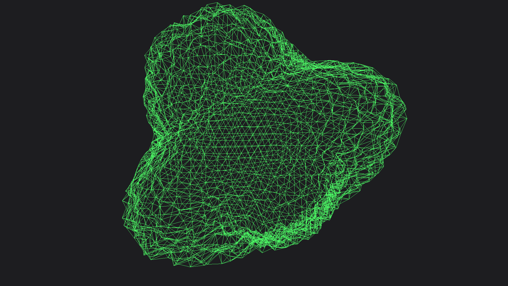

[README ru](README_ru.md) | [README en](README.md)
# Interactive Wayland Wallpaper 

Красивые, интерактивные и легко настраиваемые живые обои для вашего рабочего стола на Wayland. Проект использует аппаратное ускорение (OpenGL ES) для рендеринга динамических шейдеров с минимальным потреблением ресурсов.

Основной эффект — анимированная икосфера, которая реагирует на движения вашего курсора.

## ✨ Особенности

  * **GPU-ускорение**: Плавный рендеринг с помощью OpenGL ES, не нагружающий CPU.
  * **Интерактивность**: Обои реагируют на движения мыши и тачпада.
  * **Гибкая настройка**: Все параметры (анимация, цвета, детализация) настраиваются через простой JSON-файл.
  * **Горячая перезагрузка**: Изменения в конфигурации применяются на лету без перезапуска приложения.
  * **Утилита для управления**: Поставляется с удобным скриптом `config-manager.sh` для управления настройками.
  * **Поддержка собственных шейдеров**: Легко расширяется для использования других GLSL шейдеров.

-----

## 🎭 Демонстрация 

[](https://imgur.com/a/shader-CkNPDLc)

[](https://imgur.com/a/shader-CkNPDLc)


## 🔧 Установка

Проект состоит из двух компонентов: самих обоев (`interactive-wallpaper`) и опционального, но рекомендуемого демона для обработки ввода (`evdev-pointer-daemon`).
Их нужно собрать по отдельности.

Убедитесь, что папки `shader-desk` и `mouse` **лежат в одной директории**, если хотите использовать скрипт `run.sh`


### 1\. Зависимости

Сначала убедитесь, что у вас установлены все необходимые зависимости.

**Arch Linux:**

```bash
sudo pacman -S cmake gcc git wayland wayland-protocols libglvnd glm nlohmann-json jq inotify-tools
```

### 2\. Сборка `interactive-wallpaper`

Это основной компонент, отвечающий за отображение обоев.

```bash
# 1. Клонируйте репозиторий обоев
git clone https://gitea.com/SeeTheWall/shader-desk shader-desk
cd shader-desk

# 2. Создайте директорию для сборки и соберите проект
mkdir build
cd build
cmake ..
make -j$(nproc)
```

После успешной сборки исполняемый файл будет находиться в `shader-desk/build/interactive-wallpaper`.
### 3. Сборка `evdev-pointer-daemon` (Опционально)

Этот демон считывает события напрямую из `/dev/input/` и позволяет обойти ограничения композиторов на доступ к событиям ввода для приложений без фокуса ввода.

Если вы хотите, чтобы `interactive-wallpaper` реагировал на движения мыши и тачпада, вам необходимо собрать и запустить этот демон.

**Важные предварительные шаги:**

```bash
# Добавьте пользователя в группу input для доступа к устройствам ввода
sudo usermod -a -G input $USER

# Перезайдите в систему или выполните команду ниже для применения изменений групп
newgrp input
```

**Сборка демона:**

```bash
# 1. Клонируйте репозиторий демона
git clone https://gitea.com/SeeTheWall/mouse
cd mouse

# 2. Соберите проект
mkdir build
cd build
cmake ..
make -j$(nproc)
```

Исполняемый файл будет находиться
в `mouse/build/evdev-pointer-daemon`.

**Примечания:**
- Демон должен работать в фоновом режиме для обеспечения интерактивности
- После добавления в группу `input` может потребоваться перезагрузка
- Для Wayland-сессий демон обеспечивает полный доступ к событиям мыши/тачпада

-----

## ⚙️ Настройка

### Инициализация конфигурации

Все настройки хранятся в файле
`~/.config/interactive-wallpaper/config.json`.
Для создания файла конфигурации по умолчанию используйте скрипт `config-manager.sh`:

```bash
# Перейдите в директорию с обоями
cd /path/to/shader-desk

# Запустите инициализацию
./src/config-manager.sh init
```

### Управление настройками

**Показать текущие настройки:**
```bash
./src/config-manager.sh show
```

**Изменить параметр wireframe_mode**
```bash
# Значения: true, false, числа, или массивы в формате JSON
./src/config-manager.sh set wireframe_mode false
```

**Изменить уровень детализации сферы:**
```bash
./src/config-manager.sh set subdivisions 4
```

**Открыть конфиг в текстовом редакторе ($EDITOR):**
```bash
./src/config-manager.sh edit
```

Все изменения применяются автоматически благодаря горячей перезагрузке\!

-----

## 🚀 Запуск и интеграция с рабочим столом

Для удобного запуска и автоматического старта вместе с системой предназначен скрипт `run.sh`.

### 1\. Настройка `run.sh`

Сделайте скрипт исполняемым:
```bash
chmod +x run.sh
```

### 2\. Автозапуск в Wayland композиторах

Добавьте вызов `run.sh` в конфигурационный файл вашего композитора или иным способом реализуйте автозапуск приложений.

-----

## 🚑 Устранение неисправностей

**Обои не запускаются**:

1.  Убедитесь, что вы правильно указали пути в `run.sh`.
2.  Попробуйте запустить `interactive-wallpaper` напрямую из терминала (`./build/interactive-wallpaper`) и посмотрите на вывод ошибок.
3.  Убедитесь, что ваш Wayland композитор поддерживает протокол `wlr-layer-shell`.

**Ввод с мыши/тачпада не работает или работает странно**:

1.  Убедитесь, что `evdev-pointer-daemon` запущен.
2.  Возможно, демону требуются права на чтение из `/dev/input/event*`. Это можно решить, добавив вашего пользователя в группу `input`. 
   `sudo usermod -aG input $USER`
   После этого потребуется перезагрузка системы.

## ❤️ Содействие

Вклад в проект приветствуется\! Если у вас есть идеи, предложения или исправления, пожалуйста, создавайте Issues или Pull Requests.

## 📜 Лицензия

Этот проект распространяется под лицензией MIT. Подробности смотрите в файле `LICENSE`.