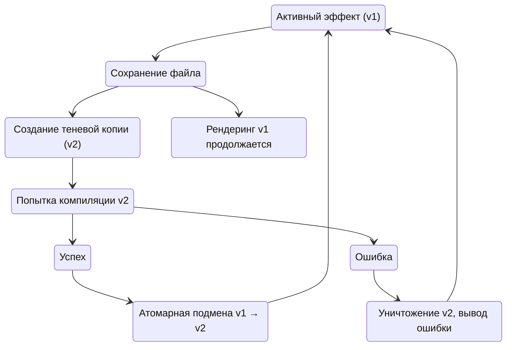

# Рабочее пространство и разработка шейдеров

Shader Desk предоставляет уникальную среду разработки для графических эффектов. Движок берёт на себя инициализацию EGL‑контекстов, перехват системных событий, управление памятью и синхронизацию с композитором, позволяя разработчику сосредоточиться исключительно на визуальной логике — написании GLSL‑кода.

В этом разделе описана организация безопасной песочницы, механизм мгновенной перезагрузки шейдеров, интеграция с ShaderToy и особенности работы с системными данными и масштабированием.

---

## 1. Пользовательская песочница (Workspace)

### 1.1. Принцип Fallback‑приоритетов

Архитектура Shader Desk использует строгий порядок поиска ресурсов. При запросе плагина ядро сначала ищет его в домашней директории пользователя, и только при отсутствии — в системных папках. Это позволяет модифицировать системные плагины без прав суперпользователя и защищает изменения от обновлений пакетов.

Пути поиска в порядке убывания приоритета:

1. `~/.config/interactive-wallpaper/effects/<plugin-name>/` — пользовательская песочница.
2. `./plugins/<plugin-name>/` — локальная сборка (для разработки).
3. `./build-*/plugins/<plugin-name>/` — сборочные директории.
4. `/usr/lib/shader-desk/plugins/<plugin-name>/` — системная установка (FHS).

### 1.2. Инициализация песочницы

Для создания пользовательской копии всех плагинов выполните:

```bash
interactive-wallpaper --init-workspace
```

Эта команда:

- Создаёт директорию `~/.config/interactive-wallpaper/effects/`.
- Копирует туда исходники всех доступных плагинов (`.cpp`, `.hpp`, `shaders/`, `presets/`).
- Автоматически внедряет скомпилированные `.so` файлы (если они есть в системе) — это позволяет сразу запускать модифицированные шейдеры без перекомпиляции C++‑кода.

После этого можно безопасно редактировать любые файлы внутри `effects/`. Оригинальные системные файлы остаются нетронутыми.

---

## 2. Анатомия бандла плагина

Каждый визуальный эффект — это самодостаточный портативный бандл:

```text
effects/my-awesome-effect/
├── my-awesome-effect.so    # Скомпилированный C++ драйвер
├── presets/                # Lua‑пресеты настроек
│   └── default.lua
└── shaders/                # Исходный код шейдеров
    ├── shader_vert.glsl
    └── shader_frag.glsl
```

Для разработки шейдеров достаточно редактировать файлы в папке `shaders/`. C++‑код (`*.so`) изменяют только при необходимости добавить новую геометрию, сложную физику или интеграцию с BlackBoard на низком уровне.

---

## 3. Hot‑Reload и Shadow‑Commit

### 3.1. Механизм мгновенной перезагрузки

Ядро подписано на события файловой системы через системный API `inotify`. При сохранении любого `.glsl` файла в песочнице движок мгновенно запускает конвейер рекомпиляции.

**Особенности процесса:**

- Перезагрузка происходит **без остановки рендеринга** — старый шейдер продолжает отрисовываться на экране.
- Перекомпилируется только фрагментный или вершинный шейдер, C++‑код не перезагружается.
- Если новый шейдер содержит синтаксическую ошибку, он не заменяет работающий — старый остаётся активным.

### 3.2. Shadow‑Commit (защита от крашей)

Основная проблема интерактивной разработки шейдеров — риск получить чёрный экран из‑за ошибки компиляции. Shader Desk решает эту проблему с помощью паттерна «теневого коммита»:

1. При сохранении файла ядро создаёт **новый экземпляр** плагина (включая все его OpenGL‑объекты) в отдельной области памяти.
2. Производится попытка скомпилировать шейдеры для нового экземпляра.
3. Если компиляция успешна, указатель на старый экземпляр атомарно заменяется на новый (Swap). Старый экземпляр уничтожается после завершения текущего кадра.
4. Если компиляция провалилась, новый экземпляр уничтожается, а в терминал выводится сообщение об ошибке. Старый экземпляр продолжает работать без изменений.



Эта схема гарантирует, что ни одна синтаксическая ошибка в GLSL не приведёт к падению композитора или отображению артефактов.

---

## 4. Интеграция с ShaderToy

Плагин `ShaderToy Sandbox` позволяет запускать эффекты с платформы ShaderToy практически без модификаций.

### 4.1. Перенос кода

Достаточно создать новый `.glsl` файл в папке `shaders/` плагина `shadertoy-effect` и вставить код из ShaderToy, содержащий функцию `mainImage()`.

Плагин автоматически:

- Добавляет недостающие объявления `#version 300 es`.
- Инжектирует стандартные униформы: `iResolution`, `iTime`, `iTimeDelta`, `iFrame`, `iMouse`.
- Передаёт координаты мыши из BlackBoard в `iMouse`.
- Обрабатывает текстурные каналы (`iChannel0`…`iChannel3`) через аннотации `@channel`.

### 4.2. Динамические параметры через аннотации

Для управления шейдером из Lua используются комментарии в формате:

```glsl
// @param имя | тип | значение_по_умолчанию | описание
```

Поддерживаемые типы: `float`, `int`, `bool`, `vec2`, `vec3`, `vec4`, `string`.

Пример:

```glsl
// @param speed | float | 2.5 | Скорость вращения
// @param color | vec3 | 1.0, 0.5, 0.0 | Основной цвет
// @param enable_grid | bool | true | Показывать сетку
```

Генератор конфигурации `shader-desk-generate` парсит эти аннотации и создаёт соответствующие параметры в Lua-файле плагина.

### 4.3. Текстурные каналы

Для загрузки изображений используется аннотация `@channelN | texture | filename.ext`:

```glsl
// @channel0 | texture | my_texture.png
// @channel1 | texture | noise.jpg
```

Плагин загружает изображения через `stb_image` в момент инициализации и при изменении пути из Lua.

### 4.4. Стандартные униформы в ShaderToy

Плагин автоматически предоставляет все стандартные униформы ShaderToy:

| Униформа | Описание |
|----------|----------|
| `iResolution` | Размер FBO (vec3), `x` и `y` — ширина и высота в пикселях, `z` = 1.0 |
| `iTime` | Время с момента запуска (float) |
| `iTimeDelta` | Дельта времени между кадрами (float) |
| `iFrame` | Номер кадра (int) |
| `iMouse` | Положение мыши (vec4), `x` и `y` — абсолютные координаты в пикселях, `z` и `w` — для нажатий |
| `iChannelN` | Текстурные сэмплеры для каналов 0…3 |

---

## 5. Доступ к системным данным из GLSL

### 5.1. Стандартные аудио-униформы

Если в `init.lua` включены провайдеры данных (audio-provider, pointer-provider), их данные автоматически транслируются в виде униформ в шейдеры, использующие стандартный конвейер (`WallpaperEffect`).

Доступные униформы (при условии работы audio-демона):

```glsl
uniform float audio_volume;
uniform float audio_bass;
uniform float audio_mid;
uniform float audio_treble;
uniform float audio_bands[64];  // точный спектр
```

Эти значения обновляются каждый кадр с частотой монитора и доступны в любом шейдере, скомпилированном через стандартный конвейер.

### 5.2. Прямой доступ к BlackBoard из шейдера

Для произвольных данных, записанных в BlackBoard через `core.set_float_array()`, можно создать кастомные униформы в C++-коде плагина и передавать их в шейдер через `glUniform*`. Этот механизм описан в разделе [SDK: визуальные плагины](04-sdk-visual-plugins.md#передача-uniform-ов).

Пример: в Lua пишем массив позиций точек:

```lua
core.set_float_array("grad.positions", {0.2, 0.3, 0.8, 0.7})
```

В C++ плагина:

```cpp
float* positions = core->get_blackboard()->bind_float_array("grad.positions", 4);
glUniform2fv(u_positions, 2, positions);
```

Шейдер получает `uniform vec2 positions[2];` и использует их.

---

## 6. Особенности HiDPI и масштабирования

### 6.1. Физическое разрешение против FBO

Wayland поддерживает масштабирование (scale factor) для HiDPI-экранов. Shader Desk также позволяет рендерить слои в пониженном разрешении через параметр `fbo_scale` в конфигурации сцены.

Это означает, что `iResolution` (и аналогичная униформа `resolution`) передаёт размер **текущего FBO**, а не физическое разрешение монитора. Если `fbo_scale = 0.5`, размер FBO будет вдвое меньше, чем физические пиксели экрана.

### 6.2. Коррекция соотношения сторон

В шейдерах, работающих с координатами, важно учитывать соотношение сторон:

```glsl
float aspect = resolution.x / resolution.y;
vec2 uv = gl_FragCoord.xy / resolution.xy;
uv.x *= aspect;  // для сохранения квадратности форм
```

### 6.3. Рекомендации для пиксель-арта

Если ваш эффект опирается на строгую попиксельную математику (например, `mod(gl_FragCoord.x, 2.0)` для создания паттернов), избегайте использования `fbo_scale` меньше 1.0, так как это приведёт к размытию. Используйте `fbo_scale = 1.0` и, при необходимости, уменьшайте разрешение через `downsample_scale` внутри самого шейдера.

---

## 7. Оптимизация шейдеров

### 7.1. Профилирование

При сборке с флагом `-DENABLE_PROFILING=ON` шейдеры можно профилировать через Tracy. В терминале отображается время выполнения каждого слоя и количество вызовов `glDrawArrays`. Это помогает выявить «тяжёлые» фрагментные шейдеры.

### 7.2. Рекомендации по производительности

- Избегайте `discard` в фрагментных шейдерах — это мешает раннему Z‑тестированию.
- Используйте `precision highp float` только там, где нужна высокая точность (например, для расстояний в реймарчинге). В остальных случаях `mediump` даёт прирост производительности.
- Сокращайте количество текстурных выборок: объединяйте каналы в один сэмплер, если это возможно.
- Используйте встроенные функции GLSL (`mix`, `clamp`, `smoothstep`) вместо ручных вычислений — они оптимизированы драйвером.

---

## 8. Связанные разделы

- **[Конфигурация и сцены](02-configuration-and-scenes.md)** — как подключать шейдеры через Lua.
- **[SDK: визуальные плагины](04-sdk-visual-plugins.md)** — для создания кастомных C++ драйверов.
- **[SDK: провайдеры данных](05-sdk-data-providers.md)** — для передачи системных данных в шейдеры.
- **[Утилиты командной строки](08-utilities-reference.md#shader-desk-generate)** — описание генератора плагинов.
