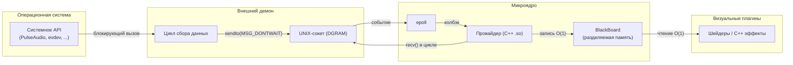

# Разработка провайдеров данных (Data Pipeline)

Провайдеры данных (Data Providers) — это специализированные C++‑плагины, работающие внутри микроядра Shader Desk. Их задача — принимать потоковые данные от внешних процессов (демонов) и записывать их в разделяемую память BlackBoard с нулевой задержкой. Благодаря этому визуальные плагины получают доступ к системным метрикам (аудиоспектр, положение мыши, температура GPU и т.д.) за $O(1)$ без блокировок и парсинга.

В этом разделе описан полный жизненный цикл создания собственного источника данных: от проектирования бинарного контракта до интеграции с Lua‑конфигурацией.

---

## 1. Архитектура конвейера данных

Конвейер состоит из трёх независимых компонентов:

1. **Внешний демон** (отдельный процесс) — взаимодействует с системными API (PulseAudio, libevdev, D‑Bus), выполняет тяжёлые вычисления (БПФ) и отправляет подготовленные пакеты в UNIX‑сокет.
2. **Провайдер** (C++‑плагин внутри ядра) — слушает тот же сокет, зарегистрирован в `epoll`, читает пакеты и пишет в BlackBoard.
3. **Потребители** (визуальные плагины или Lua) — читают данные из BlackBoard через прямые указатели.



---

## 2. Бинарный контракт (Datagram)

Демон и провайдер обмениваются структурами фиксированного размера через дейтаграммный сокет (`SOCK_DGRAM`). Это гарантирует атомарность сообщений и отсутствие необходимости в фрейминге.

**Правила проектирования структуры:**

- Используйте только типы с фиксированным размером из `<cstdint>` (`uint32_t`, `float` и т.д.).
- Упакуйте структуру с помощью `#pragma pack(push, 1)` для отключения выравнивания компилятором.
- Добавьте поле `magic` (уникальное 32‑битное число) для проверки целостности пакета.
- Зафиксируйте размер через `static_assert`.

**Пример контракта (из `audio-data.hpp`):**

```cpp
#pragma once
#include <cstdint>

#pragma pack(push, 1)
struct AudioDatagram {
    uint32_t magic = 0x41554431;  // "AUD1"
    float volume = 0.0f;
    float bass = 0.0f;
    float mid = 0.0f;
    float treble = 0.0f;
    float bands[64] = {0.0f};
};
#pragma pack(pop)

static_assert(sizeof(AudioDatagram) == 276, "AudioDatagram alignment failed");
```

**Важно:** оба компонента (демон и провайдер) должны использовать **одинаковое** определение структуры. Рекомендуется выносить контракт в общий заголовочный файл, доступный обоим проектам.

---

## 3. Разработка внешнего демона

Демон — это независимый исполняемый файл, который может быть написан на любом языке. В официальном SDK примеры реализованы на C++.

**Основные требования:**

- Использовать датаграммный сокет (`SOCK_DGRAM | SOCK_NONBLOCK`).
- Отправлять пакеты с флагом `MSG_DONTWAIT` — если ядро не успевает читать, пакет отбрасывается без блокировки.
- Путь к сокету формировать с помощью `shader_desk::get_ipc_socket_path()`.

**Типовой цикл демона (псевдокод):**

```cpp
#include <shader-desk/ipc-utils.hpp>
#include <sys/socket.h>
#include <sys/un.h>

int main() {
    int sock = socket(AF_UNIX, SOCK_DGRAM | SOCK_NONBLOCK, 0);
    struct sockaddr_un addr{};
    addr.sun_family = AF_UNIX;
    std::string path = shader_desk::get_ipc_socket_path("shader-desk-myprovider");
    strncpy(addr.sun_path, path.c_str(), sizeof(addr.sun_path)-1);
    // Если провайдер уже создал сокет, демон отправляет в него, не создавая свой.
    // В данном случае демон выступает клиентом, поэтому bind() не требуется.
    
    MyDatagram data;
    while (true) {
        // 1. Блокирующее чтение из системного API
        // float value = read_sensor();
        
        // 2. Заполнение структуры
        data.value = value;
        data.magic = MY_MAGIC;
        
        // 3. Отправка без ожидания
        sendto(sock, &data, sizeof(data), MSG_DONTWAIT,
               (struct sockaddr*)&addr, sizeof(addr));
        
        usleep(10000); // ~100 Гц
    }
}
```

---

## 4. Разработка провайдера (внутренний плагин)

Провайдер — это C++‑класс, наследующий `IDataProvider` (или напрямую `IDataProviderABI`). SDK предоставляет удобную обёртку `IDataProvider`, которая автоматически преобразует STL‑параметры в ABI‑совместимые структуры.

### 4.1. Объявление класса и параметры

```cpp
#include <shader-desk/data-provider.hpp>

class MyProvider : public IDataProvider {
public:
    const char* get_name() const override { return "My Sensor Provider"; }

    std::vector<EffectParameter> get_parameters() const override {
        return {
            {"sensitivity", "Коэффициент усиления", sensitivity},
            {"invert", "Инвертировать ось", invert}
        };
    }

    void set_parameter(const std::string& name, const EffectParameterValue& value) override {
        if (name == "sensitivity") sensitivity = std::get<float>(value);
        else if (name == "invert") invert = std::get<bool>(value);
    }

    // ... остальные методы
private:
    float sensitivity = 1.0f;
    bool invert = false;
    // ...
};
```

Эти параметры автоматически появятся в Lua‑конфигурации после вызова `interactive-wallpaper --init-config`.

### 4.2. Инициализация и создание сокета

В методе `initialize()` необходимо:

- Сохранить указатель на `ICoreContext` для последующего доступа к BlackBoard и epoll.
- Выделить память в BlackBoard через `core->get_blackboard()->bind_*()`.
- Создать дейтаграммный сокет и привязать его к тому же пути, который использует демон.
- Зарегистрировать файловый дескриптор в epoll через `core->register_epoll_fd()`.

```cpp
bool MyProvider::initialize(ICoreContext* core) {
    if (sockfd >= 0) return true; // Защита от повторной инициализации
    m_core = core;

    // 1. Выделение памяти в BlackBoard
    p_value = core->get_blackboard()->bind_float("myprovider.value");

    // 2. Создание сокета
    sockfd = socket(AF_UNIX, SOCK_DGRAM | SOCK_NONBLOCK | SOCK_CLOEXEC, 0);
    if (sockfd < 0) return false;

    struct sockaddr_un addr{};
    addr.sun_family = AF_UNIX;
    std::string path = shader_desk::get_ipc_socket_path("shader-desk-myprovider");
    strncpy(addr.sun_path, path.c_str(), sizeof(addr.sun_path)-1);
    
    // Удаляем старый сокет (если остался от предыдущего запуска)
    unlink(path.c_str());
    if (bind(sockfd, (struct sockaddr*)&addr, sizeof(addr)) < 0) {
        close(sockfd);
        sockfd = -1;
        return false;
    }

    // 3. Регистрация в epoll
    core->register_epoll_fd(sockfd, [](uint32_t, void* user) {
        static_cast<MyProvider*>(user)->on_data_ready();
    }, this);

    return true;
}
```

### 4.3. Обработка данных (Drain Pattern)

Колбэк `on_data_ready()` вызывается ядром при появлении данных в сокете. **Обязательно** реализовать цикл чтения до `EAGAIN`/`EWOULDBLOCK`, чтобы обработать все накопившиеся пакеты и сохранить только самый свежий.

```cpp
void MyProvider::on_data_ready() {
    MyDatagram latest;
    bool has_new = false;

    while (true) {
        MyDatagram tmp;
        ssize_t n = recv(sockfd, &tmp, sizeof(tmp), MSG_DONTWAIT);
        if (n < 0) {
            if (errno == EAGAIN || errno == EWOULDBLOCK) break;
            if (errno == EINTR) continue;
            break;
        }
        if (n == sizeof(MyDatagram) && tmp.magic == MY_MAGIC) {
            latest = tmp;
            has_new = true;
        }
    }

    if (has_new) {
        // Применяем пользовательские настройки (sensitivity, invert)
        float val = latest.value * sensitivity;
        if (invert) val = -val;
        *p_value = val;
    }
}
```

### 4.4. Запись в BlackBoard

Запись происходит непосредственно в ячейку памяти, полученную в `initialize()`. Это операция за $O(1)$, не требующая системных вызовов или блокировок.

### 4.5. Cleanup

При отключении провайдера (через Lua или при завершении работы) вызывается `cleanup()`. **Необходимо** отменить регистрацию сокета в epoll, иначе ядро будет вызывать колбэк для закрытого дескриптора, что приведёт к крашу.

```cpp
void MyProvider::cleanup() override {
    if (sockfd >= 0) {
        if (m_core) m_core->unregister_epoll_fd(sockfd);
        close(sockfd);
        sockfd = -1;
    }
}
```

### 4.6. C‑ABI экспорт

Провайдер экспортируется через те же функции, что и визуальные плагины, но с префиксом `provider`:

```cpp
extern "C" {
    uint32_t get_abi_version() { return SHADER_DESK_ABI_VERSION; }
    IDataProviderABI* create_provider() { return new MyProvider(); }
    void destroy_provider(IDataProviderABI* p) { delete static_cast<MyProvider*>(p); }
}
```

---

## 5. Примеры

### 5.1. Audio Provider (FFTW)

Стандартный провайдер для аудиоспектра. Демон (`audio-daemon`) захватывает звук через PulseAudio/PipeWire, вычисляет БПФ и отправляет 64 полосы частот. Провайдер (`audio-provider`) принимает пакеты, применяет сглаживание (smoothing) и эквалайзер из Lua, записывает в BlackBoard ключи: `audio.volume`, `audio.bass`, `audio.mid`, `audio.treble`, `audio.bands`.

**Особенность:** провайдер не просто копирует сырые данные, а применяет **асимметричное сглаживание** — быстрый атаку (85% нового значения) и медленный спад (управляется параметром `smoothing`). Это даёт отзывчивую на биты анимацию без резких скачков.

### 5.2. Pointer Provider (evdev)

Провайдер для мыши и тачпада. Демон (`evdev-pointer-daemon`) сканирует устройства `/dev/input/event*` и отправляет относительные дельты (`rel_dx`, `rel_dy`) и абсолютные координаты (`abs_x`, `abs_y`) в нормированном виде [0..1]. Провайдер накапливает дельты в BlackBoard по ключам `mouse.accum_x`, `mouse.accum_y`, а абсолютные координаты — в `mouse.x`, `mouse.y`.

**Важно:** провайдер учитывает чувствительность (`mouse_sensitivity`) и инверсию осей, заданные в Lua.

---

## 6. Отладка и диагностика

### 6.1. Проверка работы демона

Убедитесь, что демон запущен и отправляет данные. Можно использовать `socat` или `nc` для прослушивания сокета:

```bash
socat -u UNIX-RECV:/run/user/1000/shader-desk-myprovider.sock -
```

Если данные приходят — демон работает.

### 6.2. Проверка провайдера

В Lua можно прочитать значение из BlackBoard:

```lua
local val = core.get_float("myprovider.value", 0.0)
print("Current value:", val)
```

Если значение обновляется, провайдер корректен.

### 6.3. Логирование

Провайдер может использовать `core->log_message()` для вывода диагностических сообщений в терминал, где запущено ядро.

### 6.4. Частые ошибки

- **EADDRINUSE** при `bind()` — старый сокет не удалён. Используйте `unlink()` перед `bind()`.
- **ECONNREFUSED** при `sendto()` — провайдер не создал сокет (не инициализирован или отключён). Демон должен корректно обрабатывать эту ошибку (игнорировать).
- **Segfault в провайдере** — скорее всего, разыменование нулевого указателя BlackBoard (проверьте, что `bind_*()` вернул ненулевой указатель).

---

## 7. Связанные разделы

- **[Архитектура: Конвейер данных](07-architecture-overview.md#3-конвейер-данных-data-pipeline-и-zero-latency-ipc)** — общая схема и паттерны Fire‑and‑Forget / Socket Drain.
- **[Архитектура: BlackBoard и Trash Buffer](07-architecture-overview.md#4-blackboard-шина-памяти-и-trash-buffer)** — устройство разделяемой памяти.
- **[Lua API: Управление провайдерами](06-lua-api-reference.md#управление-провайдерами)** — как включать/отключать провайдеры из Lua.
- **[Примеры провайдеров](../plugins/audio-provider/)** и **[../plugins/pointer-provider/]** — полные исходные коды.
