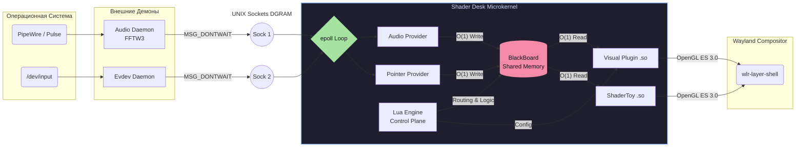
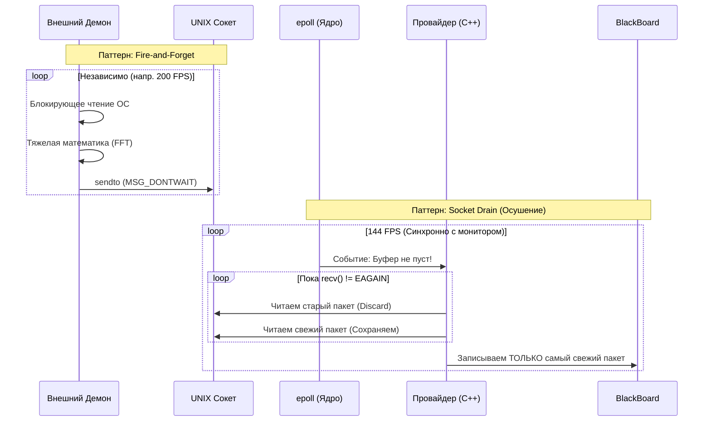
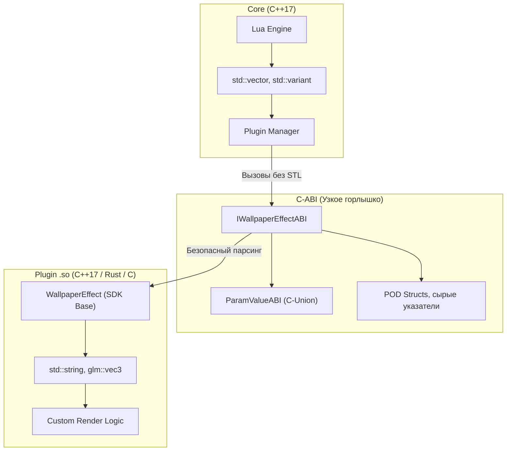
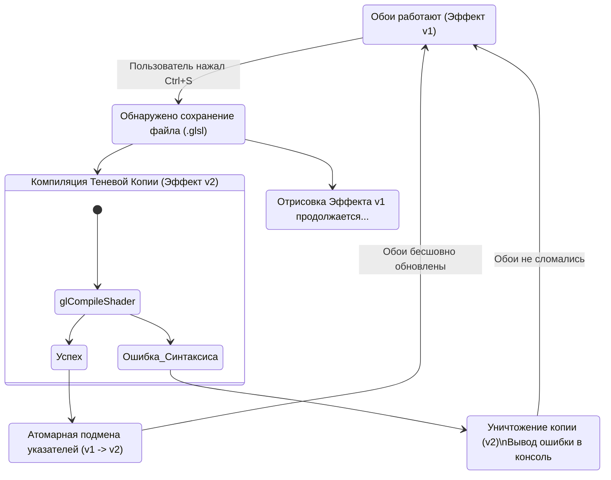

# Обзор Архитектуры (Architecture Overview)

Shader Desk — это не просто утилита для отрисовки графики на фоне. Это высокопроизводительный, отказоустойчивый маршрутизатор событий, спроектированный по принципам **микроядерной архитектуры**. 

Главная философия движка: **Графический сеанс пользователя (Wayland) никогда не должен зависать**. Любые тяжелые вычисления, блокирующие системные вызовы или ошибки в пользовательском коде строго изолированы от главного цикла рендеринга.

В этом документе описаны ключевые компоненты системы, паттерны проектирования и механизмы, обеспечивающие работу при 144+ FPS с нулевой задержкой.

---

## 1. Высокоуровневая схема системы

Движок разделен на три изолированные плоскости: сбор данных (Daemons), ядро/шина (Core) и визуализация (Plugins).

---

## 2. Микроядро и Главный цикл (epoll)

Сердце Shader Desk — это асинхронный, неблокирующий событийный цикл, построенный вокруг системного вызова Linux **`epoll`**.

В архитектуре Shader Desk "всё есть файл". Ядро прослушивает единый массив файловых дескрипторов:
*   События от дисплейного сервера Wayland.
*   Изменения файловой системы для Hot-Reload (`inotify`).
*   Входящие пакеты от демонов (`AF_UNIX` сокеты).
*   Аппаратные таймеры Lua (`timerfd`).
*   Внешние команды управления CLI (`shader-desk-ctl`).

Пока нет ни перерисовки кадра, ни новых данных, поток ядра спит (0% CPU). 

### Правило нулевых аллокаций (Zero-Allocation Loop)
Функция рендеринга `render()` выполняется синхронно с частотой обновления монитора. Внутри этой функции **строго запрещено выделять память** (операторы `new`, `malloc`, `std::vector::push_back` и т.д.). 
Стандартные аллокаторы ОС используют глобальные мьютексы. Если Shader Desk вызовет `malloc` в момент, когда другая программа захватила мьютекс кучи, цикл рендера заблокируется, и анимация обоев "дернется" (stutter). Интеграция с **Tracy Profiler** перехватывает операторы памяти на этапе компиляции и позволяет разработчикам выявлять нарушения этого правила.

---

## 3. Конвейер данных (Data Pipeline) и Zero-Latency IPC

Системные API (например, чтение свойств ALSA/PipeWire) могут быть медленными или блокирующими. Если делать это в графическом цикле, обои зависнут при сбое аудиосервера. Поэтому сбор данных вынесен в отдельные процессы (Демоны).

Конвейер построен на двух паттернах: **Fire-and-Forget** (Демон) и **Socket Drain** (Ядро).

1.  **Zombie Socket Protection:** При старте провайдер проверяет, не жив ли предыдущий процесс, и делает `unlink()` старого сокета перед `bind()`, чтобы избежать ошибки `EADDRINUSE`.
2.  **Осушение:** Провайдер вычитывает сокет в цикле `while`, пока ОС не вернет ошибку `EWOULDBLOCK`. В шину `BlackBoard` записывается только **самый последний пакет**. Если композитор "пропустил" пару пакетов мыши, он не будет проигрывать их в замедленном темпе — он моментально перескочит к актуальному состоянию.

---

## 4. BlackBoard (Шина памяти) и Trash Buffer

**BlackBoard** — это центральное Key-Value хранилище в оперативной памяти микроядра. Оно обеспечивает доступ к данным за $O(1)$ без парсинга строк и системных вызовов. C++ провайдеры получают прямые указатели на ячейки памяти (`float*`) на этапе инициализации и пишут в них напрямую.

**Защита Trash Buffer (Мусорный буфер):** 
Так как API плагинов не поддерживает C++ исключения (Exceptions), `BlackBoard` имеет жесткие лимиты (например, массивы не более 256 элементов). Если плагин пытается запросить буфер большего размера, ядро не "падает" с Segfault. Оно выводит красное предупреждение в лог и возвращает указатель на глобальный статический **"Trash Buffer"**. Плагин продолжает писать туда данные, не ломая память других компонентов и не убивая сеанс Wayland.

---

## 5. Плагины и Интерфейс Песочных Часов (C-ABI)

Движок загружает визуальные эффекты из динамических библиотек `.so`. Для гарантии того, что плагин, скомпилированный старым GCC, будет работать с ядром, скомпилированным новым Clang, используется **Hourglass Pattern** (Паттерн Песочных Часов).

В публичных заголовках `plugin-abi.hpp` нет ни одного упоминания `std::string` или `std::vector`. Используются только чистые виртуальные методы и C-объединения (`union`) фиксированного размера, скомпилированные без выравнивания (`#pragma pack`).

Каждый плагин обязан экспортировать функцию `get_abi_version()`. Если версия скомпилированного бандла не совпадает с версией ядра, загрузка отменяется, защищая систему от бинарных крашей.

---

## 6. Hot-Reload и Паттерн "Shadow-Commit"

Shader Desk позволяет редактировать исходный код шейдеров (`.glsl`) прямо во время работы обоев. Однако, если пользователь сделает опечатку (например, пропустит точку с запятой), стандартная компиляция OpenGL вернет ошибку, и на экране появится черный квадрат.

Для решения этой проблемы используется алгоритм **Shadow-Commit** (Теневой коммит):

Когда ядро через `inotify` получает сигнал об изменении файла, оно создает *полностью новый инстанс* C++ плагина и пытается инициализировать его в оперативной памяти (включая компиляцию шейдеров). Старый инстанс при этом продолжает рендериться на экран без прерываний.
Только если новая копия успешно скомпилировалась, ядро атомарно заменяет старый указатель на новый (Swap) и применяет к нему текущие цвета и настройки из конфигурации.

---

## 7. Многослойный конвейер и Ping-Pong FBO

Один монитор может отображать сложную сцену, состоящую из нескольких эффектов (например: Градиентный фон $\rightarrow$ 3D Куб $\rightarrow$ CRT-пост-обработка).

Вместо того чтобы рисовать всё в один буфер, объект физического монитора (`Output`) выделяет два Framebuffer Objects (FBO) — **Ping-Pong буферы**.
* Если слой является обычным объектом, он рисуется поверх текущего FBO.
* Если слой имеет флаг `is_postprocess = true` в Lua-конфиге, ядро меняет местами (Swap) буферы: предыдущий результат передается в шейдер как текстура `u_prev_layer`, а рендер идет в новый, чистый FBO.

Этот подход позволяет легко выстраивать конвейеры визуальных эффектов любой сложности, не заставляя авторов плагинов вручную управлять памятью видеокарты.

