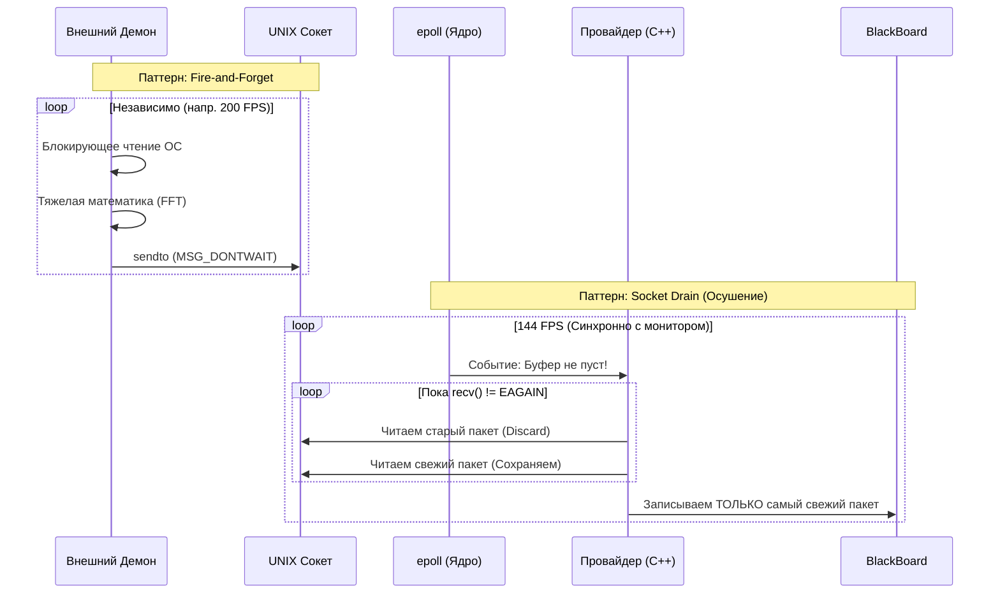
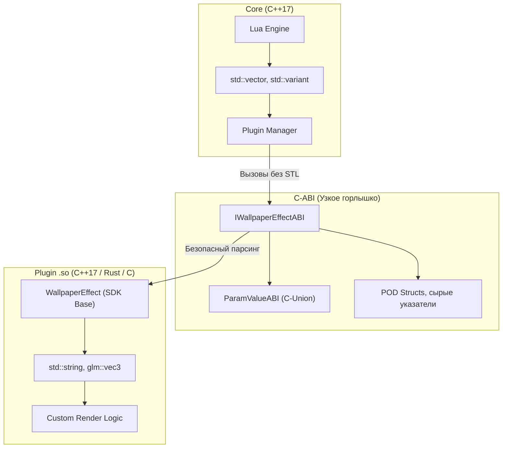
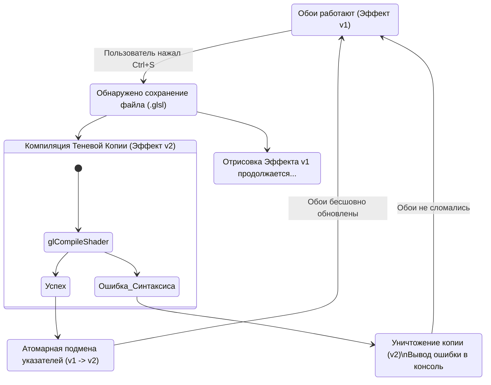
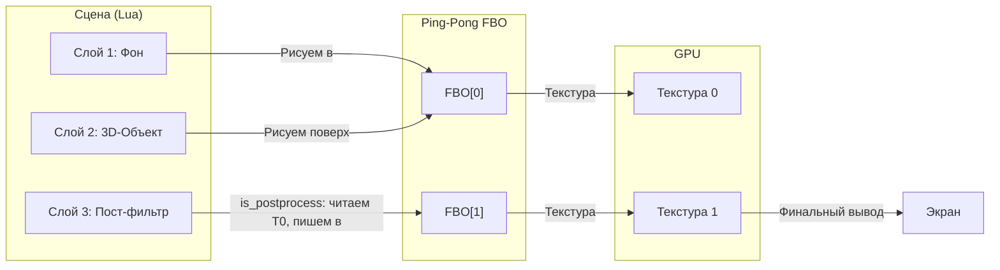

# Обзор архитектуры (Architecture Overview)

Shader Desk — это не просто утилита для отрисовки графики на фоне. Это высокопроизводительный, отказоустойчивый маршрутизатор событий, спроектированный по принципам **микроядерной архитектуры**.

Главная философия движка: **графический сеанс пользователя (Wayland) никогда не должен зависать**. Любые тяжёлые вычисления, блокирующие системные вызовы или ошибки в пользовательском коде строго изолированы от главного цикла рендеринга.

В этом документе описаны ключевые компоненты системы, паттерны проектирования и механизмы, обеспечивающие работу при 144+ FPS с нулевой задержкой.

---

## 1. Высокоуровневая схема системы

Движок разделён на три изолированные плоскости: сбор данных (Daemons), ядро/шина (Core) и визуализация (Plugins).


---

## 2. Микроядро и главный цикл (epoll)

Сердце Shader Desk — асинхронный, неблокирующий событийный цикл, построенный вокруг системного вызова Linux **`epoll`**.

В архитектуре Shader Desk «всё есть файл». Ядро прослушивает единый массив файловых дескрипторов:

- События от дисплейного сервера Wayland (wl_display).
- Изменения файловой системы для Hot‑Reload (`inotify`).
- Входящие пакеты от демонов (`AF_UNIX` сокеты).
- Аппаратные таймеры Lua (`timerfd`).
- Внешние команды управления CLI (`shader-desk-ctl`).

Пока нет перерисовки кадра, ни новых данных, поток ядра спит (0% CPU). Пробуждение происходит только при поступлении события, что обеспечивает минимальное энергопотребление и максимальную производительность.

### Правило нулевых аллокаций (Zero‑Allocation Loop)

Функция рендеринга `render()` выполняется синхронно с частотой обновления монитора (например, 144 Гц). Внутри этой функции **строго запрещено выделять память** (операторы `new`, `malloc`, `std::vector::push_back` и т.д.).

Стандартные аллокаторы ОС используют глобальные мьютексы. Если Shader Desk вызовет `malloc` в момент, когда другая программа захватила мьютекс кучи, цикл рендера заблокируется, и анимация обоев «дернется» (stutter). Интеграция с **Tracy Profiler** перехватывает операторы памяти на этапе компиляции и позволяет разработчикам выявлять нарушения этого правила.

---

## 3. Конвейер данных (Data Pipeline) и Zero‑Latency IPC

Системные API (например, чтение свойств ALSA/PipeWire) могут быть медленными или блокирующими. Если делать это в графическом цикле, обои зависнут при сбое аудиосервера. Поэтому сбор данных вынесен в отдельные процессы — **демоны**.

Конвейер построен на двух паттернах: **Fire‑and‑Forget** (демон) и **Socket Drain** (ядро).

### Паттерн Fire‑and‑Forget (демон)

Демон работает в своём процессе:

1. Блокирующий вызов к системному API (чтение звука, событий ввода).
2. Выполнение тяжёлых вычислений (например, БПФ).
3. Отправка подготовленного пакета в UNIX‑сокет с флагом `MSG_DONTWAIT`.

Если ядро не успевает читать сокет, демон не блокируется — пакет просто отбрасывается. Это гарантирует, что сбой в графическом ядре не повлияет на работу демона (и наоборот).

### Паттерн Socket Drain (ядро)

Провайдер (C++‑плагин внутри ядра) зарегистрирован в `epoll`. При появлении данных в сокете вызывается колбэк, который **обязан** прочитать все пакеты из сокета в цикле, пока `recv` не вернёт `EAGAIN`/`EWOULDBLOCK`. В шину `BlackBoard` записывается **только последний прочитанный пакет**. Таким образом, если демон спамит быстрее, чем частота кадров, мы не проигрываем устаревшие данные, а сразу переходим к актуальному состоянию.



---

## 4. BlackBoard (шина памяти) и Trash Buffer

**BlackBoard** — центральное Key‑Value хранилище в оперативной памяти микроядра. Оно обеспечивает доступ к данным за $O(1)$ без парсинга строк и системных вызовов. C++‑провайдеры получают прямые указатели на ячейки памяти (`float*`) на этапе инициализации и пишут в них напрямую.

Особенности реализации:

- Все ключи и память выделяются внутри ядра.
- Максимальный размер массива для одного ключа — **256 элементов** (защита от переполнения).
- Для строк выделяется фиксированный буфер размером 256 байт.

**Trash Buffer (мусорный буфер)**:  
Так как API плагинов не поддерживает C++‑исключения, `BlackBoard` имеет жёсткие лимиты. Если плагин пытается запросить буфер большего размера, ядро не «падает» с Segfault. Оно выводит предупреждение в лог и возвращает указатель на глобальный статический **«Trash Buffer»**. Плагин продолжает писать туда данные, не ломая память других компонентов и не убивая сеанс Wayland.

---

## 5. Плагины и интерфейс «Песочных часов» (C‑ABI)

Движок загружает визуальные эффекты из динамических библиотек `.so`. Для гарантии того, что плагин, скомпилированный старым GCC, будет работать с ядром, скомпилированным новым Clang, используется **Hourglass Pattern** (Паттерн Песочных Часов).

### Почему нельзя использовать STL на границе?

`std::string`, `std::vector` и другие контейнеры имеют разную реализацию (размер, выравнивание, управление памятью) в зависимости от версии компилятора и стандартной библиотеки. Передача таких объектов через границу `.so` ведёт к неопределённому поведению и крашам.

### Решение: C‑ABI с POD‑структурами

В публичных заголовках `plugin-abi.hpp` нет ни одного упоминания `std::string` или `std::vector`. Используются только чистые виртуальные методы (vtable) и POD‑структуры фиксированного размера, скомпилированные без выравнивания (`#pragma pack`).

Пример безопасной структуры:

```cpp
#pragma pack(push, 1)
struct ParamValueABI {
    ParamType type;
    uint32_t _pad;
    union {
        bool b_val;
        int32_t i_val;
        float f_val;
        float vec2_val[2];
        float vec3_val[3];
        float vec4_val[4];
        char s_val[504];
        uint8_t _reserved[504];
    };
};
#pragma pack(pop)
static_assert(sizeof(ParamValueABI) == 512, "ABI Breach");
```

Каждый плагин обязан экспортировать функцию `get_abi_version()`. Если версия скомпилированного бандла не совпадает с версией ядра, загрузка отменяется, защищая систему от бинарных крашей.



---

## 6. Shadow‑Commit и Hot‑Reload (защита от ошибок)

Shader Desk позволяет редактировать исходный код шейдеров (`.glsl`) прямо во время работы обоев. Однако, если пользователь сделает опечатку (например, пропустит точку с запятой), стандартная компиляция OpenGL вернёт ошибку, и на экране появится чёрный квадрат.

Для решения этой проблемы используется алгоритм **Shadow‑Commit** (Теневой коммит):

1. При сохранении файла (событие `inotify`) ядро создаёт **полностью новый инстанс** плагина и пытается инициализировать его в отдельном EGL‑контексте (или в том же, но изолируя ошибки).
2. Старый инстанс продолжает рендериться без прерываний.
3. Если новая копия успешно скомпилировалась, ядро атомарно заменяет старый указатель на новый (Swap) и применяет к нему текущие настройки из Lua.
4. Если компиляция провалилась, новая копия уничтожается, а в терминал выводится сообщение об ошибке — старые обои продолжают работать.

Этот паттерн гарантирует, что ни одна синтаксическая ошибка в GLSL не приведёт к крашу Wayland или чёрному экрану.



---

## 7. Многослойный рендеринг и Ping‑Pong FBO

Один монитор может отображать сложную сцену, состоящую из нескольких эффектов (например: Градиентный фон → 3D‑Куб → CRT‑постобработка).

Вместо того чтобы рисовать всё в один буфер, объект физического монитора (`Output`) выделяет два Framebuffer Objects (FBO) — **Ping‑Pong буферы**:

- **Чётный проход** рисует в FBO[0].
- Если следующий слой помечен как `is_postprocess = true`, ядро меняет местами буферы: предыдущий результат передаётся в шейдер как текстура `u_prev_layer`, а рендер идёт в FBO[1].
- Таким образом, фильтры могут читать результат предыдущих слоёв и модифицировать его, создавая конвейер любой сложности.

Этот подход:

- Позволяет выстраивать конвейеры визуальных эффектов без ручного управления памятью видеокарты.
- Эффективно использует кэш GPU, так как FBO остаются в видеопамяти.
- Поддерживает масштабирование: каждый слой может рендериться в пониженном разрешении (`fbo_scale`), экономя ресурсы.



---

## 8. Управление памятью и временем жизни плагинов

Плагины загружаются через `dlopen()` и выгружаются через `dlclose()`. Однако выгружать библиотеку нельзя, пока активны экземпляры её классов. Для безопасного управления используется умный указатель с кастомным делегатом:

```cpp
using WallpaperEffectPtr = std::unique_ptr<IWallpaperEffectABI, 
    std::function<void(IWallpaperEffectABI*)>>;
```

При создании экземпляра плагина через `PluginManager::create_effect()` возвращается `unique_ptr`, который захватывает `shared_ptr` на внутренний дескриптор библиотеки. Это гарантирует, что `dlclose()` будет вызван только после уничтожения последнего экземпляра эффекта.

**Важно:** в методе `render()` запрещено создавать новые `unique_ptr` или вызывать `new` — это нарушило бы правило Zero‑Allocation.

---

## 9. Восстановление после потери контекста (EGL_CONTEXT_LOST)

При переходе системы в спящий режим или переключении видеодрайверов контекст OpenGL может быть утерян. Вместо перезапуска всего приложения ядро реализует встроенный механизм восстановления:

1. Обнаружение ошибки `EGL_CONTEXT_LOST` в `eglSwapBuffers`.
2. Уничтожение всех ресурсов EGL (контекст, поверхности).
3. Повторная инициализация EGL с нуля.
4. Пересоздание FBO и перезагрузка плагинов (вызов `initialize()` для каждого эффекта).
5. Возобновление рендеринга без потери настроек Lua.

Этот механизм делает движок устойчивым к системным событиям, не требующим вмешательства пользователя.

---

## 10. Профилирование и отладка (Tracy)

При сборке с флагом `-DENABLE_PROFILING=ON` в ядро встраивается поддержка **Tracy Profiler**. Она включает:

- Перехват всех операторов `new`/`delete` с пометкой в Tracy.
- Макросы `ZoneScoped` в критических секциях кода (рендеринг, обработка событий).
- Автоматическую отправку телеметрии по сети.

Tracy позволяет разработчикам в реальном времени видеть:

- Время выполнения каждого слоя рендеринга.
- Аллокации памяти (и их нарушения в горячем пути).
- Нагрузку на CPU и пропускную способность GPU.

Без включённого флага все макросы превращаются в no‑op, и накладные расходы отсутствуют.

---

## 11. Связанные разделы

- **[Установка и настройка](01-installation-and-setup.md)** — сборка, запуск, systemd.
- **[Конфигурация и сцены](02-configuration-and-scenes.md)** — Lua‑управление, маршрутизация.
- **[Рабочее пространство и шейдеры](03-workspaces-and-shaders.md)** — разработка GLSL, Hot‑Reload.
- **[SDK: визуальные плагины](04-sdk-visual-plugins.md)** — написание C++‑плагинов.
- **[SDK: провайдеры данных](05-sdk-data-providers.md)** — создание демонов и провайдеров.
- **[Lua API справочник](06-lua-api-reference.md)** — полное описание всех функций.
- **[Утилиты командной строки](08-utilities-reference.md)** — `shader-desk-ctl`, `shader-desk-run`, генератор плагинов.
