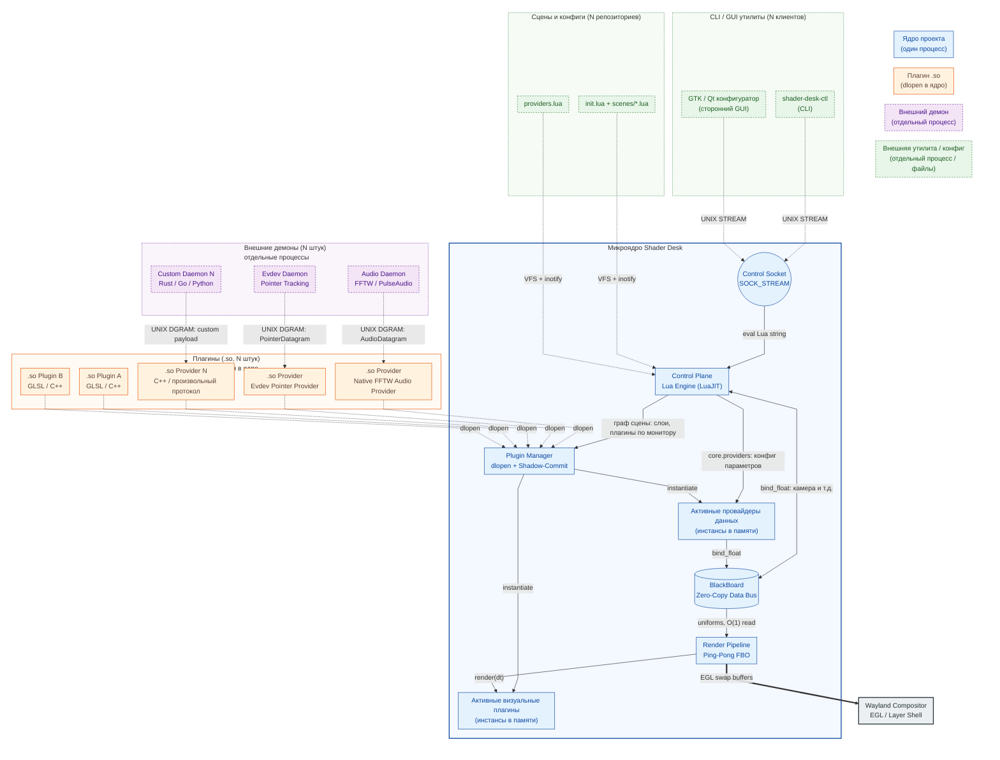

# Обзор архитектуры: Microkernel & Внешняя экосистема

Shader Desk спроектирован не как монолитное приложение, а как расширяемая платформа на базе **Микроядра (Microkernel)**. Главная архитектурная цель проекта — предоставить сообществу надежный фундамент для создания сторонних компонентов: C++ плагинов, внешних демонов (на Rust, Go, Python), CLI-утилит, GLSL-шейдеров и комплексных Lua-сцен. 

Архитектура гарантирует, что ошибки в стороннем коде (будь то опечатка в скрипте или утечка памяти во внешнем процессе) не приведут к зависанию или падению сессии Wayland-композитора.

## Высокоуровневая топология

## 1. Микроядро и Контрольная плоскость (Control Plane)
Микроядро отвечает исключительно за управление жизненным циклом ресурсов, мультиплексирование ввода-вывода (`epoll`) и связь с Wayland. Оно не содержит графической или бизнес-логики.

**Control Plane** реализована на базе интерпретатора LuaJIT. Lua выступает в роли маршрутизатора конфигурации:
* Определяет, какие плагины (`.so`) загрузить на какие физические мониторы.
* Управляет математикой камеры и анимациями в хуке `on_frame(dt)`.
* Принимает команды от внешних утилит (через `shader-desk-ctl`) и изменяет состояние графического конвейера на лету.

## 2. Изоляция границ (Hourglass Pattern)
Загрузка пользовательских C++ плагинов в адресное пространство ядра несет риск повреждения памяти из-за несовместимости ABI (разные версии компиляторов, различные реализации STL-контейнеров, таких как `std::string` или `std::vector`).

Shader Desk решает это с помощью строгого **C-ABI (Паттерн "Песочные часы")**.
Граница между ядром и `.so` библиотекой сведена к передаче POD-структур (Plain Old Data). Обмен параметрами происходит через `ParamValueABI` — строго выровненное `alignas(8)` объединение (union) размером ровно 512 байт. Это гарантирует бинарную совместимость модулей независимо от среды компиляции плагина, полностью исключая утечки памяти на границе библиотек.

## 3. Шина данных BlackBoard ($O(1)$ Routing)
Поскольку кадр должен рендериться за ~6 миллисекунд (для мониторов 144Hz), передача данных от ОС к шейдеру не может использовать хэш-таблицы, парсинг строк или аллокации.

**BlackBoard** — это центральная шина данных микроядра.
1. При инициализации плагин или демон "биндит" ключ (например, `audio.eq_curve`).
2. BlackBoard выделяет непрерывный массив в памяти и возвращает "сырой" указатель (`float*`).
3. В цикле рендера обмен сотнями параметров происходит за $O(1)$ путем прямой записи/чтения по предзакэшированному указателю.

**Защита от Segfault (Trash Buffers):** Если плагин запрашивает несуществующий ключ или выходит за пределы выделенной памяти, BlackBoard бесшовно подменяет указатель на статический `Trash Buffer` (размещенный в сегменте `.bss`). Это предотвращает падение композитора при агрессивном или некорректном чтении памяти сторонним плагином.

## 4. Zero-Latency IPC (Drain Pattern)
Внешние демоны (например, чтение аудио-спектра из PipeWire или координат мыши из `/dev/input`) выполняются как отдельные независимые процессы. Они передают данные в ядро через **файловые UNIX-сокеты типа `SOCK_DGRAM`**.

В главном `epoll` цикле ядро применяет паттерн **Drain (Осушение)**:
Вместо чтения одного пакета за кадр, ядро выгребает сокет в цикле `while(true)` до получения сигнала `EAGAIN / EWOULDBLOCK` от планировщика Linux. Для рендера используется только самая последняя, актуальная структура данных. Это нивелирует буферизацию ОС и обеспечивает нулевую задержку между событием в системе (например, басом в музыке) и реакцией шейдера на экране.

## 5. Отказоустойчивость (Fault Tolerance)
Платформа, ориентированная на расширение силами сообщества, подразумевает, что сторонний код может содержать ошибки. Ядро реализует два уровня изоляции сбоев:

1. **Shadow-Commit (Hot-Reload):** При сохранении пользователем измененного `.glsl` файла, ядро инстанцирует теневую копию плагина и пытается скомпилировать EGL-пайплайн в фоне. Если в шейдере есть синтаксическая ошибка, теневая копия уничтожается. Сессия Wayland продолжает рендерить предыдущий успешный кадр без прерываний.
2. **Native EGL Context Recovery:** Движок перехватывает сигнал `EGL_CONTEXT_LOST` (возникающий при выходе драйвера NVIDIA/Mesa из спящего режима). Ядро не завершает процесс (что привело бы к миганию черного экрана), а детерминированно разрушает старый графический конвейер, переинициализирует EGLDisplay и пересоздает все `.so` плагины на лету, восстанавливая их состояние из Lua Control Plane.

***

### Следующие шаги
* Спецификация структур памяти: [C-ABI Specification](../reference/c-abi-spec.md) *(Reference)*
* Детали работы графического конвейера: [Zero-Allocation Loop & Ping-Pong FBO](zero-allocation-loop.md) *(Explanation)*